# Hey, I'm Leon

### Software Engineer · AI Engineer · Problem Solver · Co-Founder · Penetration Testing Enthusiast

  <em>I invest in who I'm becoming, so I can build what I once wished existed.</em>

 

  

 

## About Me

I'm a **Software Engineer and problem solver** who enjoys turning real-world problems into practical software solutions.

My work spans **full-stack development, backend engineering, AI-powered applications, and software automation**. I work primarily with JavaScript and TypeScript ecosystems while also developing with **Go** for backend and systems-oriented applications.

I care about more than just writing code. I enjoy understanding a problem from the ground up, designing a solution around the people who experience it, and building software that can make that experience simpler and more effective.

One area I'm particularly interested in is solving problems within the **rental and property management space**, where I've been working on technology aimed at making interactions between landlords and renters more structured, transparent, and accessible.

I'm also a **Co-Founder at 9call**, collaborating with a team to transform ideas into software products and technology solutions.

Alongside software engineering, I'm interested in **cybersecurity and penetration testing**, with a focus on understanding how systems work and how they can be better secured.

> **I invest in who I'm becoming, so I can build what I once wished existed.**

## Technical Skills

### Languages

### Frontend

### Backend

### Databases

### AI

### DevOps & Tools

## What I Care About

**Problem Solving**
Understanding real problems and turning them into practical, usable solutions.

**Software Engineering**
Building maintainable applications, backend services, APIs, and systems.

**AI Engineering**
Using AI to make software more capable, useful, and accessible.

**Product Development**
Taking ideas beyond code and turning them into products that address real needs.

**Cybersecurity**
Exploring penetration testing, application security, networking, and secure system design.

## GitHub

 

## Connect

  

**Building with purpose. Growing through the work.**

